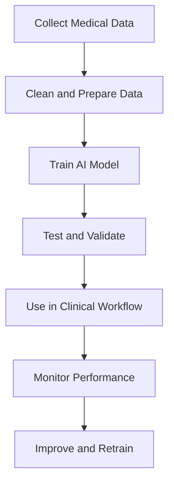

## Introduction

Artificial intelligence, or AI, refers to computer systems that can perform tasks that usually need human intelligence. These tasks may include understanding information, finding patterns, making predictions, and generating useful responses.

In health care, AI is used to support medical professionals and improve the patient experience. It can review medical images, summarize records, detect risks, assist with treatment planning, and help hospitals work more efficiently.

The biggest value of AI in health care is not that it replaces humans. Its real strength is that it helps people make faster, smarter, and more informed decisions while keeping human judgment in control.

---

## What AI Means in Health Care

AI in health care includes a wide range of technologies such as:

- Machine learning, which learns patterns from data.
- Deep learning, which is especially useful for images and medical scans.
- Natural language processing, which helps computers understand written or spoken language.
- Predictive analytics, which estimates future health outcomes.
- Generative AI, which can create summaries, reports, and answers based on input data.

These tools can work with different types of health information such as X-rays, MRI scans, blood test results, electronic health records, doctor notes, and wearable device data.

---

## How AI Works in Health Care

AI systems are trained using large amounts of medical data. Once trained, they can detect patterns that may be hard for humans to notice quickly.

For example, an AI model can analyze a chest scan and highlight areas that may need attention. Another system can review a patient’s record and estimate the chance of readmission or a health complication.

In many cases, AI does not give a final answer. Instead, it provides a recommendation, alert, prediction, or summary that supports the doctor’s decision.

---

## Main Use Cases

### 1. Medical Diagnosis

AI is one of the most useful tools in medical diagnosis. It can support the detection of diseases by analyzing images, test results, and patient records.

It is especially helpful in radiology, pathology, dermatology, and ophthalmology. AI can detect signs of fractures, tumors, infections, diabetic eye disease, and other conditions.

This helps health professionals identify problems earlier and respond faster.

### 2. Clinical Decision Support

AI can help doctors make better clinical decisions by providing useful insights from patient data.

It can estimate the risk of sepsis, heart problems, readmission, or worsening health. It can also help suggest possible next steps based on evidence and historical patterns.

This does not replace a doctor’s decision. It gives extra support so the doctor can choose the best care plan.

### 3. Patient Monitoring

AI is useful in continuous patient monitoring, especially for people with chronic diseases.

Wearable devices and remote monitoring tools can collect data such as heart rate, oxygen levels, blood pressure, glucose levels, and sleep patterns. AI can analyze this data and alert caregivers when something changes.

This makes it easier to catch health problems early, before they become serious.

### 4. Hospital Administration

Hospitals deal with a large amount of paperwork and repetitive tasks. AI can help reduce this burden.

It can assist with scheduling, record management, billing support, report summaries, and note generation. This saves time for staff and improves workflow efficiency.

When administrative work is reduced, medical teams can focus more on patient care.

### 5. Virtual Health Assistance

AI chatbots and virtual assistants can support patients by answering common questions and guiding them to the right service.

These tools can help with symptom checking, appointment guidance, medication reminders, and general health education.

They are especially useful for quick support and basic communication.

### 6. Medical Research and Drug Discovery

AI is increasingly used in medical research and the development of new treatments.

It can analyze large datasets, identify disease patterns, and help researchers find useful compounds or relationships faster than traditional methods.

This can accelerate innovation and make research more efficient.

### 7. Public Health Planning

AI can support public health teams by analyzing trends in disease spread, hospital demand, and population health.

It can help in outbreak prediction, resource planning, and early warning systems.

This improves preparedness and helps health systems respond more effectively.

---

## Advantages of AI in Health Care

### Faster Processing
AI can analyze information very quickly. This is especially valuable in emergencies, screening, and high-volume settings.

### Better Accuracy
In certain tasks, AI can improve detection and reduce missed findings when used properly and checked by professionals.

### Lower Workload
AI can handle repetitive tasks such as note writing, record sorting, and data entry, giving staff more time for direct care.

### Personalized Care
AI can use patient-specific data to support treatment plans that better match individual needs.

### Improved Access
AI can extend support to people in rural or underserved regions through telehealth, remote monitoring, and digital health tools.

### Better Efficiency
Hospitals can use AI to improve workflow, manage resources, and reduce waste.

### Stronger Decision Support
AI can provide useful insights that help clinicians make more informed decisions based on data.

---

## Implementation Guide

### Step 1: Choose a Clear Problem
The first step is to define the problem clearly. Examples include reducing scan review time, improving patient follow-up, or automating documentation.

A focused goal makes implementation easier and more effective.

### Step 2: Collect and Prepare Data
AI depends on good-quality data. This may include medical images, records, lab results, and patient history.

The data should be clean, secure, accurate, and diverse enough to reflect different age groups, genders, and health conditions.

### Step 3: Build the AI Model
Developers select the right method based on the problem.

For image analysis, deep learning may be best. For prediction tasks, machine learning may be more suitable. For text-based health support, language models may be used.

### Step 4: Test and Validate
The AI system should be tested carefully before use in real care settings.

Validation helps confirm that the system works safely, accurately, and consistently in different situations.

### Step 5: Integrate Into Workflow
AI should fit naturally into the hospital or clinic process.

If the tool is difficult to use, it may slow down staff instead of helping them. Good design makes AI easy to adopt.

### Step 6: Train Health Workers
Doctors, nurses, and administrative staff should be trained to understand how the AI tool works.

They should know what the system can do, what it cannot do, and how to respond to its output.

### Step 7: Monitor and Improve
AI systems should be reviewed regularly after deployment.

Performance can change over time if data patterns shift. Continuous monitoring helps keep the system safe, useful, and fair.

---

## Limitations and Challenges

### Data Bias
If the training data is not balanced, the AI system may work better for some groups than others.

This can create unfair outcomes and widen health inequalities.

### Privacy and Security
Health information is highly sensitive. AI systems must protect patient data and prevent misuse.

Strong security measures are necessary to maintain trust.

### Lack of Transparency
Some AI models are difficult to understand, even for experts.

This can make it hard to explain why a result was produced, which may reduce trust.

### Safety Risks
AI can make mistakes, especially when the data is poor or the model is used in the wrong way.

For this reason, human oversight is always important.

### Over-Reliance on Technology
Health workers may sometimes trust AI too much. This can be risky if the system gives an incorrect result.

AI should support decision-making, not replace it.

### Regulatory Issues
Rules for AI in health care are still evolving in many countries.

Organizations must follow current laws and ethical standards carefully.

### Infrastructure Needs
AI systems often require strong digital infrastructure, skilled staff, and ongoing maintenance.

This can be challenging for smaller hospitals or low-resource settings.

---

## Comparison Table

| Area | What AI Does | Main Benefit | Main Risk |
|---|---|---:|---|
| Diagnosis | Analyzes scans, reports, and test data | Faster detection | False positives or missed cases |
| Monitoring | Tracks health data from wearables and devices | Early warning | Data noise or poor sensor quality |
| Administration | Automates paperwork and scheduling | Saves staff time | Workflow disruption |
| Patient Support | Answers questions and guides users | Better access to information | Incorrect guidance |
| Research | Finds patterns in large datasets | Faster discovery | Biased or incomplete findings |

---

## AI Health Care Workflow



---

## Simple Infographic View

```text
AI in Health Care
┌──────────────────────────────┐
│ Input Data                   │
│ Scans, records, lab results  │
└──────────────┬───────────────┘
               │
               ▼
┌──────────────────────────────┐
│ AI Analysis                  │
│ Finds patterns and predicts  │
└──────────────┬───────────────┘
               │
               ▼
┌──────────────────────────────┐
│ Output                       │
│ Alerts, summaries, insights  │
└──────────────┬───────────────┘
               │
               ▼
┌──────────────────────────────┐
│ Human Review                 │
│ Doctor checks final decision │
└──────────────────────────────┘
```

---

## Best Practices for Safe Use

- Keep humans involved in final decisions.
- Use diverse and high-quality data.
- Test the system before full deployment.
- Protect patient privacy and security.
- Train staff properly.
- Monitor the system regularly.
- Update the model when performance changes.
- Use AI to support care, not replace clinical judgment.

---

## Future of AI in Health Care

The future of AI in health care is likely to include more personalized treatment, smarter hospital systems, better digital assistants, and stronger support for medical research.

More advanced AI tools may help doctors manage larger patient loads while improving quality of care. At the same time, responsible use will remain essential, especially in areas like privacy, fairness, safety, and accountability.

AI will continue to grow, but the most successful systems will be the ones that work well with people, not against them.

---

## Conclusion

AI in health care is a powerful technology with the potential to improve diagnosis, monitoring, treatment, administration, and research.

It offers many benefits such as speed, efficiency, and better decision support. However, it also has important limitations, including bias, privacy concerns, safety risks, and the need for careful human oversight.

The best approach is to use AI responsibly, with clear goals, strong data, proper testing, and trained professionals guiding the final decisions.
